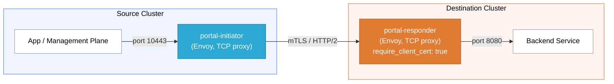
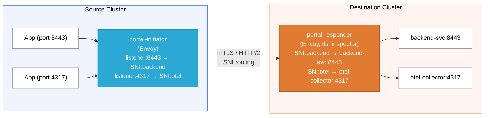

# Portal

<p align="center">
  
</p>

Portal creates secure, multiplexed reverse tunnels between Kubernetes clusters
using [Envoy Proxy](https://www.envoyproxy.io/). It automates mTLS certificate
provisioning, Envoy deployment on both ends, and tunnel lifecycle management --
all without introducing new services into the data path.

## When Are Reverse Tunnels Useful?

Traditional service connectivity requires the target cluster to be reachable
from the caller. This breaks down in common real-world topologies:

- **Private clusters behind NAT/firewalls** -- Clusters in air-gapped
  environments, on-prem data centers, or edge locations cannot accept inbound
  connections from a management plane.
- **Multi-cloud and hybrid deployments** -- Connecting services across AWS,
  GCP, Azure, and on-prem without VPN peering or shared network fabric.
- **Zero-trust networking** -- Avoiding broad firewall rules by having the
  remote side initiate the connection outbound to a known endpoint.
- **Management plane connectivity** -- A centralized control plane (e.g.,
  Synapse) needs to configure and observe gateway deployments in clusters it
  cannot directly reach.

A reverse tunnel inverts the connection model: the remote (initiator) cluster
dials out to a publicly reachable endpoint on the destination (responder)
cluster. Once the mTLS tunnel is established, traffic flows bidirectionally
over the encrypted connection. No inbound firewall rules are required on the
initiator side.

## How It Works



- **Initiator** (source cluster): Envoy configured as a TCP proxy that dials
  the responder over mTLS with HTTP/2 multiplexing.
- **Responder** (destination cluster): Envoy listening behind a LoadBalancer
  (or NodePort/ClusterIP) that terminates mTLS, validates the client
  certificate, and forwards traffic to a local backend service.
- **Per-tunnel CA**: Each tunnel gets its own self-signed CA. Compromise of one
  tunnel's certificates does not affect any other tunnel.
- **TLS 1.3 enforced**: Both sides require TLS 1.3 as the minimum protocol
  version.

### Multi-Service Tunnels

A single tunnel can multiplex multiple services using SNI-based routing. Each
service gets its own listener port on the initiator and its own filter chain on
the responder:



The responder uses Envoy's `tls_inspector` listener filter to read the SNI from
the TLS ClientHello without terminating TLS, then routes to the correct backend
via `filter_chain_match.server_names`. Each service gets a dedicated Envoy
cluster on the responder side.

## Installation

### From Source

Requires Go 1.23+.

```bash
git clone https://github.com/tetratelabs/portal.git
cd portal
go build -o portal ./cmd/portal
```

Set version at build time:

```bash
go build -ldflags="-X main.Version=v0.1.0" -o portal ./cmd/portal
```

### Prerequisites

- **kubectl** on `PATH`, configured with contexts for both clusters
- **Docker** (for the KIND-based demo)

## Quick Start

### Imperative (one command)

Deploy a tunnel between two clusters. Portal discovers the LoadBalancer IP,
generates certificates, and applies manifests to both sides:

```bash
portal connect kind-source kind-destination
```

Deploy a multi-service tunnel that routes multiple backends over a single
connection:

```bash
portal connect source-ctx dest-ctx \
  --service backend=backend-svc.ns.svc:8443 \
  --service otel=otel-collector.ns.svc:4317 \
  --service-local-port backend=18443
```

When you are done:

```bash
portal disconnect kind-source kind-destination
```

### Declarative (GitOps)

Generate manifests to disk for use with Kustomize, Argo CD, or Flux:

```bash
portal generate source-ctx destination-ctx \
  --responder-endpoint "34.120.1.50:10443" \
  --output-dir ./tunnel-manifests
```

Multi-service works with `generate` too:

```bash
portal generate source-ctx dest-ctx \
  --responder-endpoint "34.120.1.50:10443" \
  --output-dir ./tunnel-manifests \
  --service backend=backend-svc.ns.svc:8443 \
  --service otel=otel-collector.ns.svc:4317
```

Apply with kubectl or your GitOps controller:

```bash
kubectl apply -k ./tunnel-manifests/destination/ --context destination-ctx
kubectl apply -k ./tunnel-manifests/source/ --context source-ctx
```

## Commands

| Command | Description |
|---------|-------------|
| `portal connect` | Deploy a tunnel to both clusters imperatively |
| `portal disconnect` | Tear down a tunnel and clean up resources |
| `portal generate` | Generate manifests to disk for GitOps workflows |
| `portal generate expose` | Generate expose manifests to disk |
| `portal expose` | Expose a service through an existing tunnel |
| `portal status` | Show tunnel status and Envoy connection stats |
| `portal list` | List all known tunnels |
| `portal rotate-certs` | Rotate leaf TLS certificates using the existing CA |

### portal connect

```
portal connect <source_context> <destination_context> [flags]

Flags:
  --responder-endpoint   Responder address (IP:port or hostname:port); LB-discovered if omitted
  --namespace            Namespace for portal components (default: portal-system)
  --tunnel-port          Responder listen port (default: 10443)
  --cert-validity        Certificate validity duration (default: 8760h)
  --cert-manager         Use cert-manager CRDs instead of raw Secrets
  --cert-dir             Use existing certs from a shared directory
  --initiator-cert-dir   Use existing certs for initiator from this directory
  --responder-cert-dir   Use existing certs for responder from this directory
  --envoy-image          Envoy proxy image (default: envoyproxy/envoy:v1.37-latest, pinned by digest)
  --service-type         Responder Service type: LoadBalancer, NodePort, ClusterIP (default: LoadBalancer)
  --service              Service to route: sni=host:port (repeatable)
  --service-local-port   Override initiator listener port: sni=port (repeatable)
  --deploy-timeout       Timeout waiting for deployment readiness (default: 5m)
  --lb-timeout           Timeout waiting for LoadBalancer address (default: 5m)
  --dry-run              Print rendered manifests without applying
```

When `--responder-endpoint` is omitted, Portal uses a two-phase deployment:
deploy the responder first, wait for the LoadBalancer IP, then re-render and
deploy the initiator with the real endpoint.

### portal generate

```
portal generate <source_context> <destination_context> [flags]

Flags:
  --output-dir           Directory to write manifests (required)
  --responder-endpoint   Responder address (required)
  --service              Service to route: sni=host:port (repeatable)
  --service-local-port   Override initiator listener port: sni=port (repeatable)
  --initiator-cert-dir   Use existing certs for initiator from this directory
  --responder-cert-dir   Use existing certs for responder from this directory
  (plus all shared flags from connect except deploy-timeout, lb-timeout, dry-run)
```

Output structure:

```
<output-dir>/
+-- source/            # Apply to source cluster
|   +-- kustomization.yaml
|   +-- namespace.yaml
|   +-- portal-initiator-*.yaml
|   +-- portal-tunnel-tls-secret.yaml
+-- destination/       # Apply to destination cluster
|   +-- kustomization.yaml
|   +-- namespace.yaml
|   +-- portal-responder-*.yaml
|   +-- portal-tunnel-tls-secret.yaml
+-- tunnel.yaml        # Tunnel metadata
+-- ca/                # CA material (keep private, git-ignored)
    +-- ca.crt
    +-- ca.key
    +-- .gitignore
```

### portal expose

```
portal expose <context> <service> --port <port> [flags]

Flags:
  --port                 Port the service listens on (required)
  --local-port           Initiator listener port (default: same as --port)
  --sni                  Custom SNI value (default: service name)
  --service-namespace    Namespace of the service (default: default)
  --tunnel               Tunnel name (required if context matches multiple tunnels)
```

Creates a ClusterIP Service in the opposite cluster and updates both the
responder and initiator Envoy configs with the new service route. Expose is
additive -- calling it multiple times adds services to the existing tunnel
without disrupting already-routed services.

### portal rotate-certs

```
portal rotate-certs <tunnel-dir> [flags]

Flags:
  --cert-validity   New certificate validity (default: reuse from tunnel.yaml)
```

Re-issues leaf certificates from the existing CA. After rotation, re-apply the
updated secrets and restart the deployments:

```bash
portal rotate-certs ./tunnel-manifests
kubectl apply -f ./tunnel-manifests/destination/portal-tunnel-tls-secret.yaml --context dest-ctx
kubectl apply -f ./tunnel-manifests/source/portal-tunnel-tls-secret.yaml --context source-ctx
kubectl rollout restart deployment/portal-responder -n portal-system --context dest-ctx
kubectl rollout restart deployment/portal-initiator -n portal-system --context source-ctx
```

### portal status

```
portal status [<source_context> <destination_context>] [--json]
```

With no arguments, shows a summary of all tunnels. With two arguments, shows
detailed status including pod health, Envoy connection metrics (active
connections, bytes sent/received, TLS handshakes), and per-service health
derived from Envoy cluster stats:

```
Tunnel: dp1--mgmt (Connected)
  Services:
    backend (SNI: backend)  -> backend-svc:8443  healthy
    otel    (SNI: otel)     -> otel-collector:4317  healthy
```

### portal list

```
portal list [--json]
```

Lists all tunnels from `~/.portal/tunnels.json` in a table format.

## Certificate Management

Portal supports two certificate management modes:

### Built-in PKI (default)

Portal generates a per-tunnel self-signed CA and issues leaf certificates for
the initiator (client auth) and responder (server auth). The CA material is
persisted locally for certificate rotation.

- **Key size**: RSA 4096
- **Default validity**: 1 year
- **TLS minimum**: TLSv1.3
- **Rotation**: `portal rotate-certs` re-issues leaves from the existing CA

### cert-manager Integration

With `--cert-manager`, Portal generates cert-manager Issuer and Certificate
CRDs instead of raw Kubernetes Secrets. cert-manager handles automatic renewal.

```bash
portal connect source dest --cert-manager
```

### External Certificates

Bring your own certificates using split cert directories. Each directory must
contain `tls.crt`, `tls.key`, and `ca.crt`:

```bash
portal connect source dest \
  --initiator-cert-dir ./certs/initiator \
  --responder-cert-dir ./certs/responder
```

Or use a shared directory when both sides use the same cert material:

```bash
portal connect source dest --cert-dir ./certs/shared
```

When using the Go library API, certificates can be provided as PEM bytes via
the `ExternalCertificates` struct (see Go Library section below).

## Generated Kubernetes Resources

For each side of the tunnel, Portal generates:

| Resource | Purpose |
|----------|---------|
| Namespace | Isolated namespace (default: `portal-system`) |
| ServiceAccount | Dedicated SA, no auto-mounted token |
| ConfigMap | Envoy bootstrap configuration |
| Secret or Certificate | TLS certificates (raw Secret or cert-manager CRD) |
| Deployment | Envoy proxy pod with hardened security context |
| Service | Responder-side LoadBalancer/NodePort/ClusterIP |
| NetworkPolicy | Restricts ingress/egress to tunnel traffic and DNS |

### Container Security

All Envoy pods run with a hardened security context:

- `runAsNonRoot: true` (UID 1000)
- `readOnlyRootFilesystem: true`
- `allowPrivilegeEscalation: false`
- All capabilities dropped
- Seccomp profile: `RuntimeDefault`

## Demo

A full end-to-end demo using KIND clusters is available in
[docs/demo/README.md](docs/demo/README.md). It covers:

1. Creating two KIND clusters with MetalLB
2. Generating and deploying tunnel manifests
3. Sending HTTP traffic through the mTLS tunnel
4. Verifying connectivity via Envoy admin stats
5. Rotating certificates

Run the automated demo:

```bash
./docs/demo/demo.sh
```

Or follow the step-by-step guide for a deeper understanding.

## Local State

Portal stores tunnel metadata in `~/.portal/tunnels.json` for imperatively
created tunnels. This file tracks tunnel names, contexts, namespaces, ports,
and exposed services. CA certificates are stored in `~/.portal/certs/<tunnel>/`.

For GitOps workflows (`portal generate`), all state lives in the output
directory and the file can be committed to version control (except the `ca/`
directory, which is git-ignored by default).

## Go Library API

Portal can be used as a Go library (`import "github.com/tetratelabs/portal"`)
for programmatic tunnel management. This is how Synapse integrates Portal into
its Helm-based deployment workflow.

```go
import "github.com/tetratelabs/portal"

// Single-service tunnel
bundle, err := portal.RenderTunnel(portal.TunnelConfig{
    SourceContext:      "dp-cluster",
    DestinationContext: "mgmt-cluster",
    ResponderEndpoint:  "tunnel.example.com:10443",
})

// Multi-service tunnel
bundle, err := portal.RenderTunnelWithServices(portal.TunnelConfig{
    SourceContext:      "dp-cluster",
    DestinationContext: "mgmt-cluster",
    ResponderEndpoint:  "tunnel.example.com:10443",
}, []portal.ServiceConfig{
    {SNI: "backend", BackendHost: "backend-svc.ns.svc", BackendPort: 8443},
    {SNI: "otel", BackendHost: "otel-collector.ns.svc", BackendPort: 4317},
})

// Add a service to an existing tunnel
bundle, err := portal.AddService(cfg, existingServices, portal.ServiceConfig{
    SNI: "metrics", BackendHost: "metrics.ns.svc", BackendPort: 9090,
})

// Generate certificates separately
certs, err := portal.GenerateCertificates("my-tunnel", []string{"10.0.0.1"}, 24*time.Hour)

// Provide external certificates (skip auto-generation)
bundle, err := portal.RenderTunnel(portal.TunnelConfig{
    // ...
    ExternalCerts: &portal.ExternalCertificates{
        CACert:        caCertPEM,
        InitiatorCert: initCertPEM,
        InitiatorKey:  initKeyPEM,
        ResponderCert: respCertPEM,
        ResponderKey:  respKeyPEM,
    },
})
```

The returned `ManifestBundle` contains `Source` and `Destination` resource
slices (each with `Filename` and `Content` fields) plus a `Metadata` struct
with tunnel information including the service configuration.

## Project Layout

```
portal.go              Go library API (RenderTunnel, RenderTunnelWithServices, AddService, GenerateCertificates)
cmd/portal/            CLI entrypoint
internal/
  cli/                 Command implementations (connect, disconnect, expose, etc.)
  manifest/            Kubernetes manifest rendering and disk I/O
  envoy/               Envoy bootstrap configuration templates
    templates/         Single-service + multi-service (SNI-routing) Envoy YAML templates
  certs/               mTLS certificate generation and rotation
  kube/                Kubernetes client abstraction (kubectl wrapper)
  state/               Local tunnel state persistence (~/.portal/tunnels.json)
docs/
  demo/                Demo walkthrough, scripts, and patches
  PRD.md               Product requirements document
```

## Security

See [SECURITY.md](SECURITY.md) for the threat model, trust boundaries,
certificate lifecycle details, and operational security recommendations.
